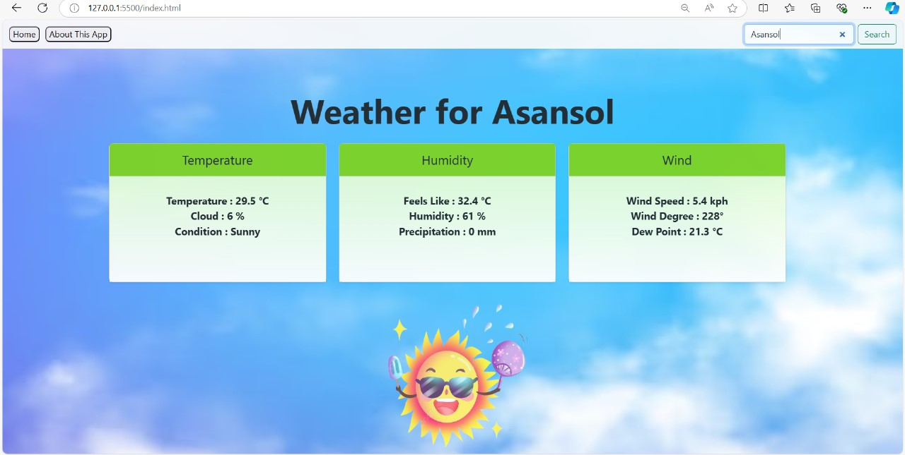

# Weather App

The Weather App is a user-friendly web application designed to provide real-time weather information for any city around the world. It offers a clean and intuitive interface where users can quickly access current weather conditions, including temperature, humidity, wind speed, and more.

## Key Features
- **Real-Time Weather Data:** Displays up-to-date weather information such as temperature, cloud coverage, feels like temperature, humidity, precipitation, wind speed, and dew point.
- **Search Functionality:** Allows users to easily search for weather updates by entering the name of a city.
- **Visual Representation:** Provides a visual representation of the weather conditions with dynamic images that change based on the current weather.

## Technologies Used
- **HTML:** Provides the basic structure and content of the application.
- **CSS (Bootstrap):** Enhances the visual design and responsiveness of the app with modern styling and layout options.
- **JavaScript:** Handles the logic and interactivity, including fetching data from the weather API and updating the UI.
- **WeatherAPI (via RapidAPI):** Supplies accurate and reliable weather data for the application.

## How It Works
1. **User Input:** Users enter a city name in the search bar.
2. **Data Fetching:** The app sends a request to the WeatherAPI through RapidAPI.
3. **Data Display:** The retrieved weather data is displayed on the screen, including a description and visual representation of the current weather conditions.

This application is designed to be simple yet powerful, offering users a seamless way to stay informed about the weather no matter where they are.

